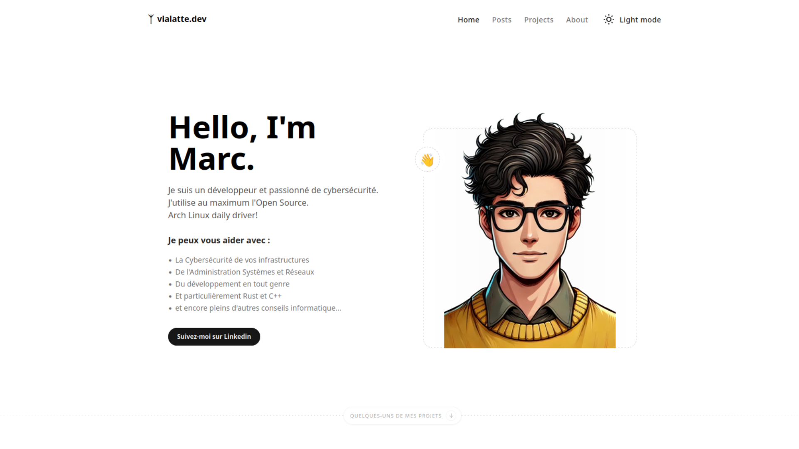

# Bienvenue sur mon site 👋

Découvrez mon site dédié à la programmation et à la cybersécurité ! 

Ce site a été conçu pour partager mes connaissances, offrir mes services en tant que freelance ou plus simplement présenter mon profil professionnel, et explorer des sujets qui me passionnent : la programmation, la sécurité informatique, et l'innovation technologique.

---

## 🛠️ Technologies et Template Utilisés

Ce site a été construit à l'aide d'un template moderne et flexible que vous pouvez retrouver [ici](https://github.com/ccbikai/astro-aria), que j'ai personnalisé pour répondre à mes besoins.

---

## 🌟 Objectifs du site

- **Accompagner entreprises et particuliers** dans leurs projets technologiques.
- **Partager mes connaissances et conseils** en matière de programmation et cybersécurité.
- **Proposer des solutions digitales sur mesure** avec un haut niveau de sécurité.

---

## 📑 Contenu principal

- Articles et conseils sur des sujets techniques.
- Informations sur mes services de freelance.
- Un aperçu de mon parcours et de mes compétences.

---

## 🚀 En savoir plus

Pour plus de détails sur mon parcours, mes compétences, et mes services, explorez le site !

---

Merci de votre visite et à bientôt ! 😊
